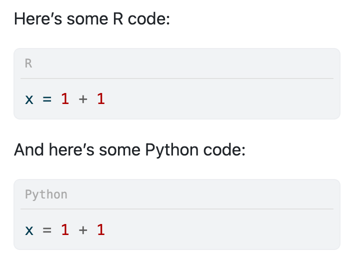
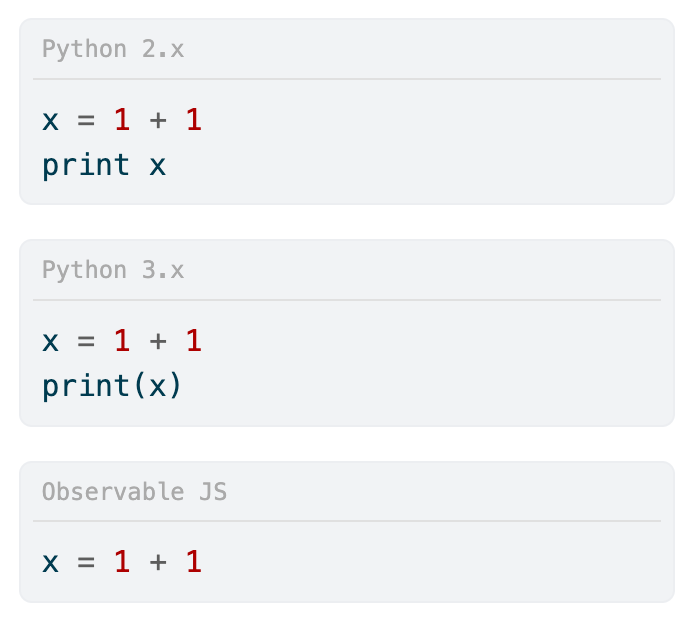

# Quarto language names

- [Overview](#overview)
- [Installation](#installation)
- [Usage](#usage)
- [TODO some day!](#todo-some-day)

<!-- README.md is generated from _README.qmd. Please edit that file -->

## Overview

In multilingual (programming languages; not human languages) Quarto documents, there’s no easy way to indicate what language code is in. You can describe it with text and comments:

Here’s some R code:

``` r
# This is R!
# (some people like the = instead of the <-)
x = 1 + 1
```

And here’s some Python code:

``` python
# This is Python!
x = 1 + 1
```

But the reader has to read the preceding text and check the comments. With things like [Observable JS](https://quarto.org/docs/computations/ojs.html), it’s easy to have a document ([like this](https://www.andrewheiss.com/blog/2025/02/10/usaid-ojs-maps/)) that works with R or Python, makes an R or Python object [available to Observable](https://quarto.org/docs/computations/ojs.html#data-sources), and then plots it with [Observable Plot](https://observablehq.com/plot/). Within the document, however, all the languages will look the same—they’ll be syntax-highlighted correctly according to each language, but there won’t be a clear signal of what each code chunk is.

[The Tabby Quarto extension](https://quarto.thecoatlessprofessor.com/tabby/) makes it easy to place multilingual chunks of code side-by-side as panels in a tabset, but that’s mostly for showing the same code across multiple languages and won’t work well in a document that mixes languages throughout.

This extension uses [CSS pseudo-classes](https://developer.mozilla.org/en-US/docs/Web/CSS/Pseudo-classes) to add the name of the language to HTML code blocks:

<p align="center">
  
</p>

You can customize the language too, like specifying version names or flavors of Javascript:

<p align="center">
  
</p>

## Installation

To install this extension in your current directory (or into the Quarto project that you’re currently working in), use the following terminal command:

``` sh
quarto add andrewheiss/language-name
```

This will install the extension in the `_extensions` subdirectory. If you’re using version control, you will want to check in this directory.

## Usage

**⭐✨⭐ [See this page for full examples!](https://andrewheiss.github.io/language-name/example.html) GitHub doesn’t allow for custom CSS, so nothing will be visible there. ⭐✨⭐**

Enable the filter by including it in the YAML front matter of a document:

``` yaml
---
title: Your title
filters:
  - language-name
---
```

By default, the language name will be added to all language-specific blocks in the document. You can disable this with the `show-all` option in the YAML front matter:

``` yaml
---
title: Your title
filters:
  - language-name
language-name:
  show-all: false
---
```

You can control whether a name appears within each block of code with the `show-language` option:

```` default
```{.r show-language="false"}
# No language name
x <- 1 + 1
```
````

```` default
```{.r show-language="true"}
# Yes language name
x <- 1 + 1
```
````

You can control the text that appears in with the `language-title` option:

```` default
```{.sh language-title="Terminal (sh)"}
$ ls
```
````

It works with computational chunks too, but the options have to be defined in the chunk options:

```` markdown
```{r}
#| show-language: true
#| language-title: "R (the best)"

mean(1:5)
```
````

    [1] 3

## TODO some day!

- Right now this only works with HTML output. It would be neat if it worked in other formats (PDF, Typst, Word lol) like Quarto’s native [code filename option](https://quarto.org/docs/output-formats/html-code.html#code-filename) or the [icons in callout blocks](https://quarto.org/docs/authoring/callouts.html).

- Right now you have to set a custom title for each chunk that uses it. If your whole document only uses R and Observable, you have to add `language-title="Observable JS"` to each chunk yourself. It would be cool to have more global custom title settings that you could change up in the document YAML.
